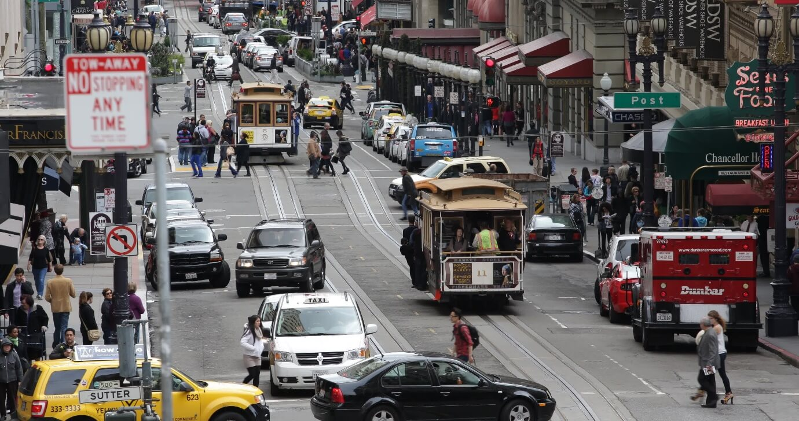
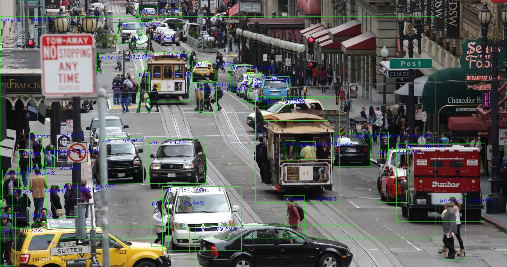

# PictureThis
A webapp that crease a story from a user-provided image. 

Deployed on heroku. (Here is a [link](http://suatakbulut.com/) to the app) 

Accepts an image in .jpg, .jpeg, and .png format. Detects the onject in the image using YOLOV3 object detection algorithm. 
Then creates a short tale using the detected objects' information as keywords. 

## How does it work?

As an example, Let's upload the following "test.jpeg" as an example. 


First the Yolov3 algorithm will detect the images inside the image, label them and put them inside boxes as follows:


Detection algorithm, in fact, returns a json file similar to:
```python
detected_objects_details = [
 {'name': 'person',
  'percentage_probability': 99.88,
  'box_points': [775, 540, 829, 639]},
        ...
        ... 
 {'name': 'car',
  'percentage_probability': 62.31,
  'box_points': [709, 213, 794, 285]},
 {'name': 'bus',
  'percentage_probability': 90.79,
  'box_points': [394, 143, 514, 282]},
 {'name': 'truck',
  'percentage_probability': 60.89,
  'box_points': [418, 51, 502, 116]}]
```

Feeding this json into our message text and sending it to writesonic api yields a story, which we then display in our display page. Here is an example. 

<h3 style="text-align: center;">Unexpected Traffic Jam</h3>
<p style="text-align: left;">
It was supposed to be an average day for John. He was driving down the highway, heading to his office, when he noticed the unusual traffic jam. The cars and trucks on the road seemed to be going nowhere. As he waited, he observed that people had abandoned their cars and were trying to figure out what was going on.
</p>
<p style="text-align: left;">
John decided to investigate and see if he could help. He walked down the road and found himself amidst a crowd, staring in amazement at the unusual sight before them. A group of people were standing in a circle around a motorcycle, admiring its design.
</p>
<p style="text-align: left;">
As John looked around, he saw many more people standing in small groups, chatting intently. He approached one group and asked what was happening, and to his surprise, they told him about the "motorcycle exhibition" that was being held on the highway.
</p>
<p style="text-align: left;">
Suddenly, John realized that this was no ordinary traffic jam. In fact, it was caused by hundreds of people who had stopped their cars to admire the beautiful motorbikes and cars that were being showcased on the highway. There were vintage cars, sleek motorcycles, and even a few trucks on display.
</p>
<p style="text-align: left;">
John couldn't help but join in on the fun. He walked around, taking in the sights, and talking to the owners of the vehicles. He was amazed by the passion and dedication that went into restoring and maintaining these vehicles.
</p>
<p style="text-align: left;">
After a couple of hours, the event came to an end, and the people started returning to their cars to continue their journey. As John got back into his car, he couldn't help but think about how unexpected life could be sometimes. What he thought was going to be an uneventful day turned out to be a memorable experience that he would never forget.
</p>

## Have fun! 
